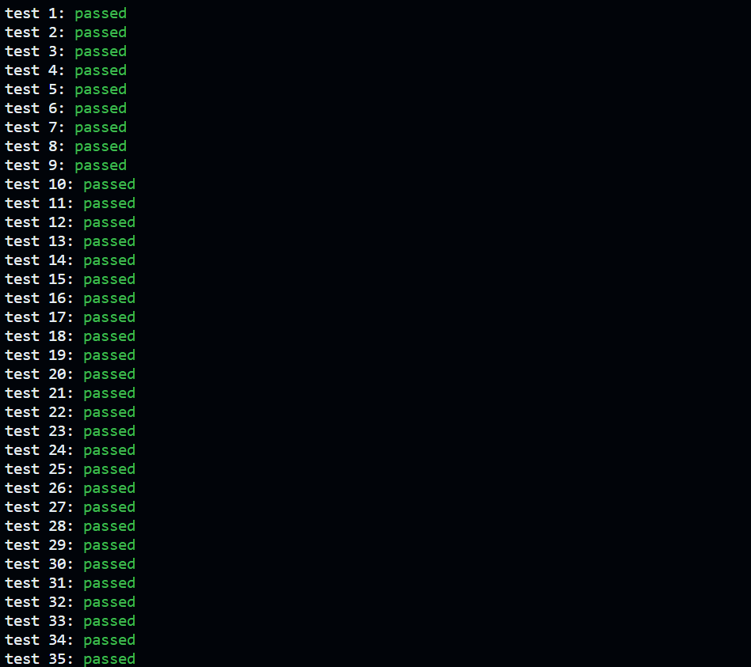

[](https://classroom.github.com/a/cdIHSfWh)
# Malloc and Free



### Makefile

```makefile
all: libmem.so

libmem.so:
	# your compile commands
	gcc -c -fpic mem.c -Wall -Werror
	gcc -shared -o libmem.so mem.o

clean:
	rm -f libmem.so mem.o
```

先`make clean`，然后`make`

### Note

- 完成某项功能时请补充说明文档，代码关键部分需要添加注释语句
- 一个`block`的`head`的最大大小不超过16bytes
- 请求内存时，必须使用`mmap`，操作系统通过调用`mmap`扩展进程地址空间的堆部分，然后内存分配器将内存分配给调用进程，我们实现的部分是内存分配器
- 内存分配器是在单个进程的虚拟地址空间内运行
- 无需关心哪些物理页面分配给该进程，以及逻辑地址与物理地址之间的映射关系，因为这些都在调用`mmap`时由操作系统决定了
- 虽然真正的内存分配器在无法满足用户请求时会向操作系统请求更多内存，但本次实现的内存分配器必须只调用一次`mmap`
- `void free(void *ptr)`，释放ptr指向的的空间，该空间必须是之前调用`malloc/calloc/realloc`返回的。如果ptr为NULL，则不执行任何操作

### Block 

#### Data Structure

```c
// represent a free memory block
typedef struct Block
{
    size_t size; //size of a memory block
    struct Block* next; //points to the next free block if it's in the free list.
    int magic;  //Used to determine at release time whether the current block of memory is the one allocated by a previous call to mem_alloc
}Block;
```

- 如果不设置`magic`校验位则会在test28出现错误

  `tests/src/badfree.c`

  ```c
  void* ptr = Mem_Alloc(8, M_WORSTFIT);
  assert(ptr != NULL);
  assert(Mem_Free((void*)ptr + 8) == -1);
  ```

  正确的指针参数应是`ptr`，在`Mem_Free`中添加判断条件`block->magic!=123456`可判断错误传入的指针参数

#### Static Global Variable

```c
static void* memory=NULL;   //pointer to the allocated memory region
static size_t memory_size=0;    //size of the allocated memory region
static Block *free_list=NULL;   //Linked list of free memory blocks
static size_t max_size = 0;          //point to the max block from the start to curr
static Block *search_prt = NULL;    //point to the last time addr of FT
```

### Mem_Init

`int Mem_Init(int size_of_region)`

- `Mem_Init`会被使用本内存分配器的进程调用一次。`size_of_region`是应该使用`mmap`向操作系统请求的字节数

- 以页面大小为单位申请内存。需要将分配的内存用于自定义的数据结构

- 首先判断是否是多次调用`Mem_Init`，或是请求内存区域大小小于等于0，这两种情况都应该设置错误码并返回-1

  ```c
      if(memory!=NULL||size_of_region<=0){    //region!=NULL indicates that Mem_Init has been called previously,size_of_region<=0 is an illegal memory request
          m_error=E_BAD_ARGS;
          return -1;
      }
  ```

- 将请求内存大小与页面大小对齐

  ```c
      //ensure size_of_region is a multiple of the pagesize
      size_of_region=((size_of_region+PAGESIZE-1)/PAGESIZE)*PAGESIZE;
  ```

- 按照lab教程，使用`mmap`将归零的页面（即分配新页面）映射到调用进程的地址空间

  ```c
      int fd=open("/dev/zero",O_RDWR);
      if(fd==-1){
          perror("open");
          return -1;
      }
  
      memory=mmap(NULL,size_of_region,PROT_READ|PROT_WRITE,MAP_PRIVATE,fd,0);
      if(memory==MAP_FAILED){
          perror("mmap");
          return -1;
      }
  
      close(fd);//close the device (don't worry, mapping should be unaffected)
  ```

- 设置空闲链表的相关参数并返回0表示初始化成功

  ```c
      memory_size=size_of_region;
  
      free_list=(Block*)memory;
      free_list->size=size_of_region-sizeof(Block);
      free_list->next=NULL;
  
      return 0;
  ```

### Mem_Alloc

- 待分配对象的大小(以字节为单位)作为输入，并返回指向该对象起点的指针。

- 首先判断参数错误，当请求内存块大小小于等于0，或是分配模式不属于三种模式中的任一种时，设置错误码并返回NULL

  ```c
      if(size<=0||(style!=M_BESTFIT&&style!=M_WORSTFIT&&style!=M_FIRSTFIT)){
          m_error=E_BAD_ARGS;
          return NULL;
      }
  ```

- 遍历空闲块链表找到指定分配的模式下的最佳空闲内存块

  ```c
      Block* prev=NULL;
      Block* curr=free_list; 
      Block* prev_free_block=NULL; //points to the previous free block of the best free block found
      Block* free_block=NULL; //points to the best free block found
      int free_block_size;
  
      if(style==M_BESTFIT){
          free_block_size=memory_size;
      }else if(style==M_WORSTFIT){
          free_block_size=0;
      }
  
      while(curr!=NULL){
          if(curr->size>=size){
              if(style==M_FIRSTFIT){
                  prev_free_block=prev;
                  free_block=curr;
                  break;
              }
              if(style==M_BESTFIT&&curr->size<free_block_size){
                  prev_free_block=prev;
                  free_block=curr;
                  free_block_size=curr->size;
              }
              if(style==M_WORSTFIT&&curr->size>free_block_size){
                  prev_free_block=prev;
                  free_block=curr;
                  free_block_size=curr->size;
              }
          }
          prev=curr;
          curr=curr->next;
      }
  ```

- 如果没有足够的连续空闲空间来满足该请求，则设置错误码并返回NULL

  ```c
      if(free_block==NULL){
          m_error=E_NO_SPACE;
          return NULL;
      }
  ```

- 如果找的的空闲块的空间大于所需要的空间，则分割空闲块，将分割出的另一部分空闲块加入空闲链表

  ```c
      if(free_block->size>size+sizeof(Block)){//split the block
          Block* new_free_block=(Block*)((char*)free_block+size+sizeof(Block));
          new_free_block->size=free_block->size-size-sizeof(Block);
          new_free_block->next=free_block->next;
          free_block->size=size;
          free_block->next=NULL;
          if(prev_free_block==NULL){
              free_list=new_free_block;
          }else{
              prev_free_block->next=new_free_block;
          }
      }else{
          if(prev_free_block==NULL){
              free_list=free_block->next;
          }else{
              prev_free_block->next=free_block->next;
          }
      }
  ```

- 为空闲块设置magic，表示这是个已被分配的内存块

  ```c
      free_block->magic=123456;
      return (void*)(free_block+1);
  ```


### Mem_Free

- 如果ptr为NULL，则不执行任何操作。

  ```c
      if(ptr==NULL){
          return 0;
      }
  ```

- 如果ptr对应的内存块不在分配器的内存范围内，或是该内存块不是之前通过`Mem_Alloc`分配的内存块，则设置错误码并返回-1

  ```c
      Block* block=(Block*)((char*)ptr-sizeof(Block));
      if(block<(Block*)memory||block>=(Block*)((char*)memory+memory_size)||block->magic!=123456){
          m_error=E_BAD_POINTER;
          return -1;
      }
  ```

- 将该内存块标记为空闲块

  ```c
      block->magic=0;
  ```

- 将该内存块加入到空闲链表合适的位置中，将相邻的空闲块重新连接成一个更大的空闲块

  ```c
      if(free_list==NULL){
          free_list=block;
      }else{
          Block* prev=NULL;
          Block* curr=free_list;
          while(curr!=NULL&&(char*)curr<(char*)block){
              prev=curr;
              curr=curr->next;
          }
          if(((char*)block+block->size+sizeof(Block))==(char*)curr){
              block->size+=curr->size+sizeof(Block);
              block->next=curr->next;
          }else{
              block->next=curr;
          }
          if(prev!=NULL){
              if(((char*)prev+prev->size+sizeof(Block))==(char*)block){
                  prev->size+=block->size+sizeof(Block);
                  prev->next=block->next;
              }
              else{
                  prev->next=block;
              }
          }else{
              free_list=block;
          }
      }
  ```


### 优化 M_FIRSTFIT策略，设置寻指针

+ **思路**

  设置一个寻指针，每次查找结束时，寻指针指向当前使用的block；设置一个max_size参数，记录从起始到寻指针之间的最大空闲块值。当进行下一次分配时，若所需size大于max_size，则从寻址针开始查询，从而**减少搜索可用空闲分区时的开销**

+ **Variable**:

  + global: 

      ```C
      static size_t max_size = 0;      // point to the max block from the   start to curr
      static Block *search_prt = NULL; // point to the history addr of FT
      static Block *prev_search_prt = NULL; // point to the prev block of search_prt
      ```

      

+ 具体**代码实现**思路：

  + **在函数`Mem_Alloc `中**

    + 首先判断**寻指针是否为空**，不为空则说明不是第一次进行分配；

    + 判断max_size是否等于0，不等于0，说明上一次搜索存在移动curr指针的情况

    + 判断 **size >? max_size**，若大于，则应将搜索起始地址设为寻指针，且将prev设置为寻指针的前一个block

      ```C
      if (search_prt != NULL && max_size != 0 && size > max_size)
      {
          //printf("search_prtt=%d,",(int)search_prt->size);
          prev = prev_search_prt;
          curr = search_prt;
      }
      ```

    + 对空闲链表进行遍历，多了一行 **将当前block的size与max_size 进行比较**，从而不断更新max_size使其为最大值

      ```C
      while (curr != NULL)
      //....
          max_size = max_size < curr->size ? curr->size : max_size;
      //....
      }
      ```

  + **在函数 `split_block` 中**，curr_block 将被**分割**，在此根据情况设置 寻指针 的值

    + 情况1： 分割时，**寻指针指向新空闲块**

      ```C
      if (free_block->size > size + sizeof(Block))
      {
          //...
          search_prt = new_free_block;
          prev_search_prt = prev_free_block;
      }
      ```

    + 情况2：不分割，将当前空闲块整个删掉时，**寻指针指向当前空闲块的下一个block**

      ```C
      else
      {
          //...
          search_prt = free_block->next;
          prev_search_prt = prev_free_block;
      }
      ```

  + **在函数 `Mem_Free`中**，重置search_prt

    ```C
    int Mem_Free(void *ptr)
    {
        search_prt = NULL;
        //...
    }
    ```

+ **性能测试**

  + 在`Mem.h`中添加了`Mem_Alloc_Origi`，以便后续对原策略和优化策略进行对比分析。

  + 添加 [benchmark_ori_ft.c](benchmark_ori_ft.c) 

    输出运行时间结果至 [out_ori.txt](out_ori.txt) 

  + 添加  [benchmark_new_ft.c](benchmark_new_ft.c) 

    输出至 [out_new.txt](out_new.txt) 

    > Worst Case 指一直从第一个开始查，用不到寻指针的情况
    >
    > Best Case 指每一次都将利用寻指针提高效率的情况

  +  run

    ```shell
    gcc benchmark_new_ft.c mem.c -o benchmark_new_ft
    gcc benchmark_ori_ft.c mem.c -o benchmark_ori_ft
    ```

    ```shell
    ./benchmark_new_ft
    ./benchmark_ori_ft
    ```

  + 测试结果

    + 第一次

      + [out_ori.txt](out_ori.txt) 


      ```
      -----Worst Case-----
      ori_FT took 0.007784 seconds
      -----Best Case-----
      ori_FT took 0.047814 seconds
      ```
    
      +  [out_new.txt](out_new.txt) 


      ```
      -----Worst Case-----
      new_FT took 0.008626 seconds
      -----Best Case-----
      new_FT took 0.009169 seconds
      ```
    
    + 第二次
    
      + ```
        -----Worst Case-----
        ori_FT took 0.008216 seconds
        -----Best Case-----
        ori_FT took 0.011556 seconds
        ```
    
      + ```
        -----Worst Case-----
        new_FT took 0.008478 seconds
        -----Best Case-----
        new_FT took 0.009264 seconds
        ```
    
    + 第三次
    
      + ```
        -----Worst Case-----
        ori_FT took 0.008688 seconds
        -----Best Case-----
        ori_FT took 0.012246 seconds
        ```
    
      + ```
        -----Worst Case-----
        new_FT took 0.008007 seconds
        -----Best Case-----
        new_FT took 0.008262 seconds
        ```

